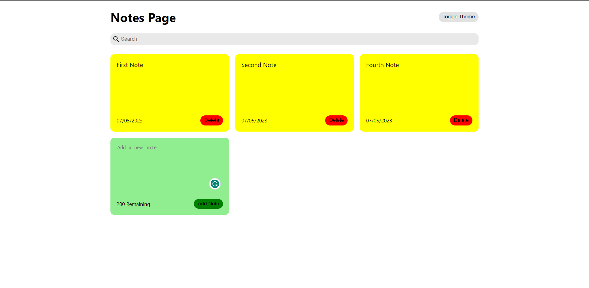
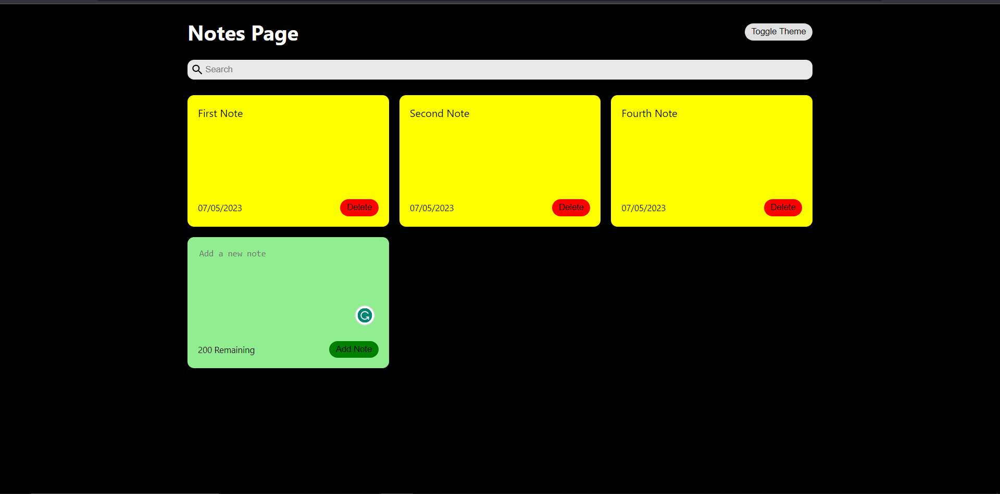

# START

### Run `npm start` to start the project.

Open [http://localhost:3000](http://localhost:3000) to view it in your browser.

# ABOUT

This is a simple React.js project to learn and get used to the features of React.
This project is a notes webpage that allows you to add notes, delete added notes and filter through your notes by text.

# IMAGES

